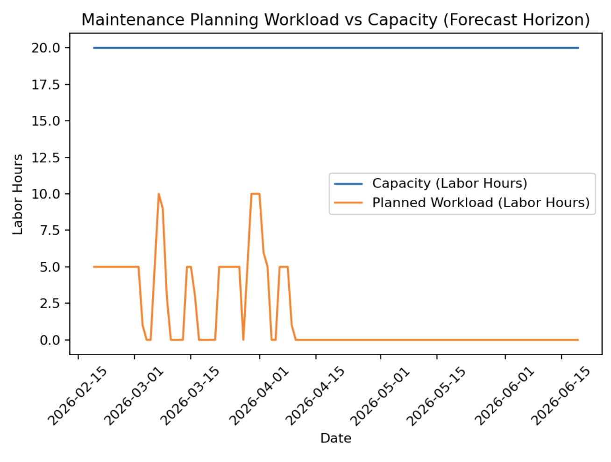
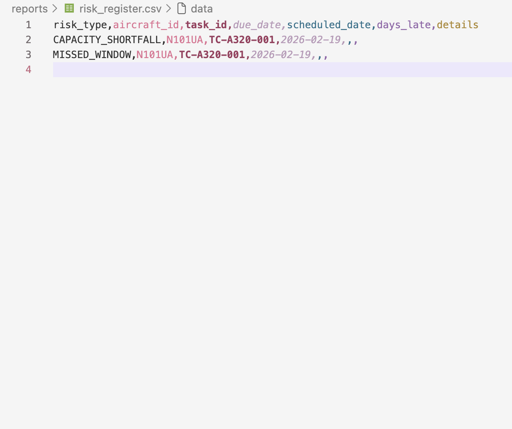
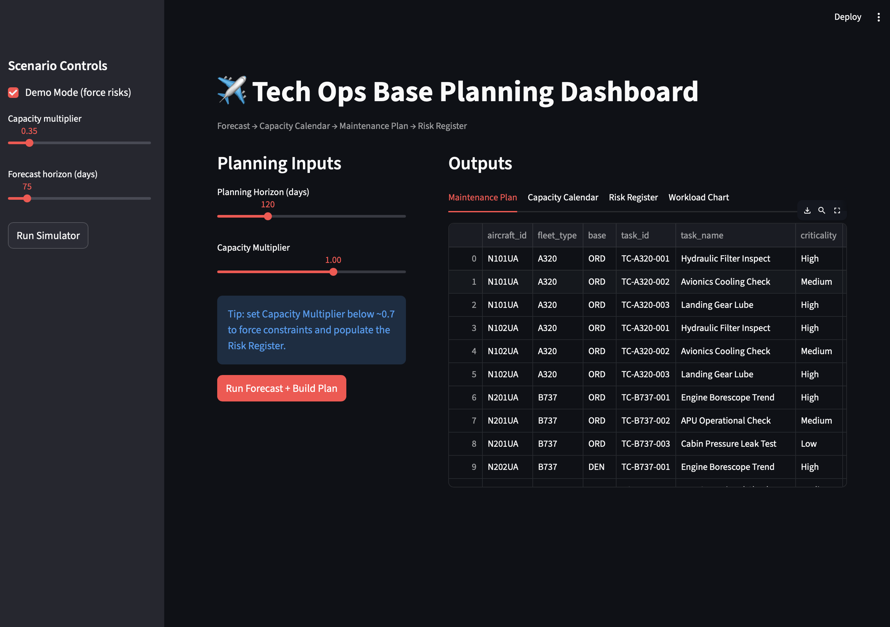

# Aircraft Maintenance Forecast Simulator
[](https://www.python.org/)
[](https://pandas.pydata.org/)
[](https://matplotlib.org/)
[](https://streamlit.io/)
[](#)

A lightweight **Technical Operations Base Planning** simulator that forecasts upcoming maintenance, builds a capacity-aware plan, and generates planning outputs for stakeholder review.

Inspired by airline planning workflows: **task cards**, **maintenance windows**, **labor capacity**, **schedule alignment**, and **risk flagging** for overdue or constrained work.

## Why this project
United’s Tech Ops Base Planning teams work with long-term forecasts, workload and capacity, and planning analysis to keep fleet maintenance on track. This simulator demonstrates the core planning mindset:

- Interpreting a **forecast** of due maintenance
- Building a **capacity calendar**
- Allocating work into valid **maintenance windows**
- Producing **recurring and ad hoc outputs** (CSV reports + chart)
- Flagging **risks and anomalies** when constraints prevent an on-time plan

## What it does
Given a sample fleet and a set of maintenance task cards, the simulator:

1. Forecasts maintenance **due dates** within a planning horizon  
2. Creates a base-level **capacity calendar** (labor hours per day)
3. Schedules tasks using a greedy planning algorithm within each task’s maintenance window
4. Generates reports:
   - `maintenance_plan.csv` (planned maintenance by aircraft and due date)
   - `capacity_calendar.csv` (capacity vs used labor by base and day)
   - `risk_register.csv` (overdue, missed window, late schedule, capacity shortfall)
   - `workload_vs_capacity.png` (visual workload trend)

## Planning workflow (diagram)
```mermaid
flowchart TD
  A[Load fleet.csv + task_cards.csv] --> B[Forecast due maintenance within horizon]
  B --> C[Build capacity calendar: labor hours per base/day]
  C --> D[Schedule tasks within maintenance windows]
  D --> E{Constraints satisfied?}
  E -- Yes --> F[Generate plan + capacity + chart]
  E -- No --> G[Create risk_register.csv: missed window / late / shortfall / overdue]
  F --> H[Optional: Streamlit dashboard view]
  G --> H
  ```


##  Demo Screenshots

### Baseline Planning Scenario (Capacity Fits Plan)



---

### Reduced Capacity Scenario (Risk Register Triggered)



---

### Interactive Planning Dashboard (Streamlit)



## Demo Simulationg operation risk scenarios 
This simulator can intentionally stress capacity to demonstrate how planning constraints generate operational risk similar to real-world base planning pressure scenarios.

##  Baseline (helathy plan)
run: 
```bash
python -m src.main
```
Expected:
	•	100% scheduled rate
	•	Empty risk register
	•	Workload fits within daily labor capacity

This represents a stable maintenance planning environment.

## Constrained Capacity (Risk Scenario)
Inside src/main.py, reduce capacity:
```bash 
capacity_cfg = CapacityConfig(
    labor_hours_per_day=40,  # reduce capacity to create stress
    horizon_days=120
)
```
re run 
```bash 
python -m src.main
```
Expected:
	•	Missed maintenance windows
	•	Capacity shortfalls
	•	Late scheduling flags
	•	Risk register populated

This simulates:
	•	Labor shortages
	•	Heavy check clustering
	•	Fleet growth without base scaling
	•	Operational disruptions

If the plan schedules all tasks within capacity and window constraints, the **risk register may be empty**. To demonstrate risk flagging, reduce capacity in `src/main.py`.

## Interactive Dashboard 
Launch
```bash 
streamlit run dashboard.py
```
Use the capacity slider to dynamically simulate:
	•	Normal operations (1.0)
	•	Reduced staffing (0.5)
	•	Severe constraints (0.3)

Observe:
	•	Utilization spikes
	•	Risk register entries
	•	Maintenance window violations

## Tech stack
- Python
- Pandas (datasets + reporting)
- Matplotlib (workload chart)
- Modular design: forecasting, scheduling, risk logic, and I/O separated into `src/`

## Project structure
```txt
aircraft-maintenance-forecast-simulator/
  data/
    fleet.csv
    task_cards.csv
  reports/
    maintenance_plan.csv
    capacity_calendar.csv
    risk_register.csv
    workload_vs_capacity.png
  screenshots/
    baseline_workload.png
    risk_register.png
    dashboard_view.png
  src/
    io_utils.py
    simulator.py
    scheduler.py
    risk.py
    main.py
  dashboard.py
  README.md
```

## Getting Started 
1) Create environment + install dependencies
```bash 
python -m venv .venv
source .venv/bin/activate
pip install -r requirements.txt
```
2) Run the Simulator
```bash
python -m src.main
```
3) view outputs 
Open the reports/ folder for CSVs and the workload chart.

## Example planning concepts modeled 
	•	Maintenance forecasting: next due date based on interval
	•	Maintenance windows: schedule work within allowable time windows
	•	Workload and capacity: labor-hour constraints by base/day
	•	Planning analysis: utilization %, planned workload trend
	•	Risk register:
	•	OVERDUE
	•	MISSED_WINDOW
	•	LATE_SCHEDULE
	•	CAPACITY_SHORTFALL

Extend it (next improvements)
	•	Multiple fleets, task priorities, and deferrable work (DIP-style logic)
	•	More realistic planning heuristics (priority + criticality weighting)
	•	Reading/importing maintenance records to compute due dates from history
	•	Summary dashboard outputs for stakeholder review

